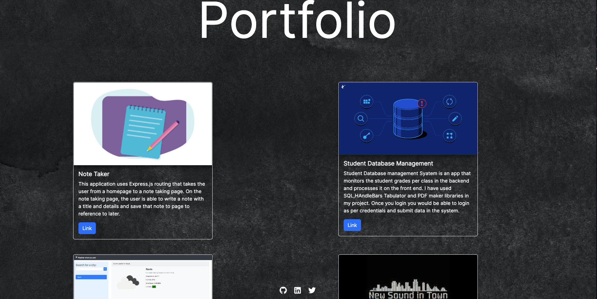

# porfolio-sankarsh 

## Description 

This is a Portfolio built using REACT and some vanilla javascript and CSS. Through this project i was able to learn how REACT operates and how easy it is compared to regular Web Development. SOme of the challenges i had included embeding images and overwritng bootstrap commands. I learnt how to input multiple data using Javacsript compared to the old HTML which was harder.

## Installation 

In order to use the application click on the link below . 

https://sankyrajeev.github.io/portfolio-sankarsh

## Usage 

Home Page

About Page

Portfolio Page 

Contact Page. 

## Credits 

I used BOOTSTRAP as the front end framework. 

